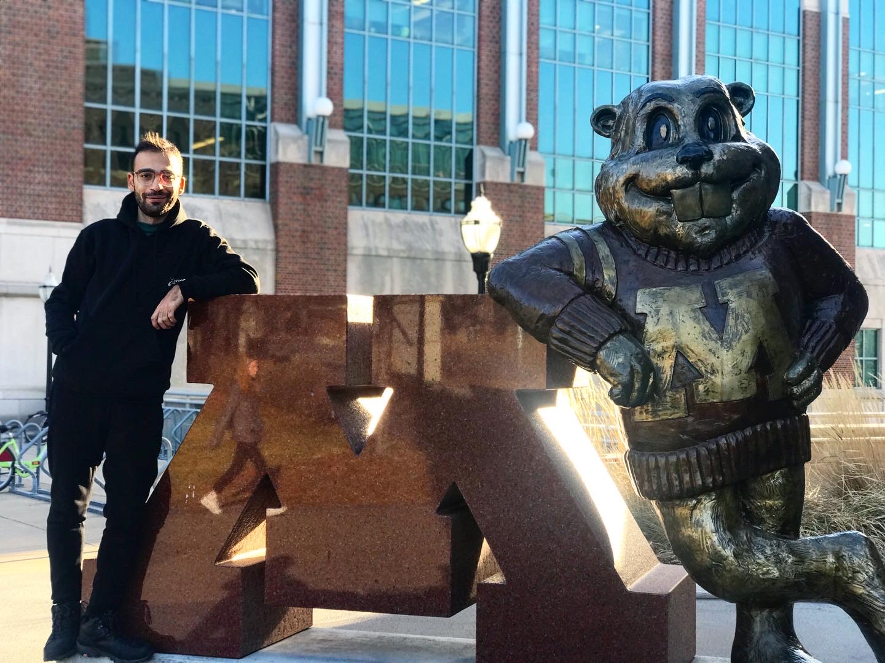

  

 
Greetings!

I'm Mahdi, a passionate Ph.D. student in Mechanical Engineering at the <a href="https://twin-cities.umn.edu/" target="_blank" style="color: black; text-decoration: underline;">University of Minnesota</a> in the USA, specializing in computational mechanics. My research delves into its applications across diverse fields, including Biomedical Engineering, Transport Phenomena, and Multiphase flow.

I earned my Master's degree in Mechanical Engineering from the University of Tehran, Iran, where I explored various facets of thermofluids. From green technology and applying machine learning to micro-nano fluid mechanics, my research spanned a wide spectrum. The focal point of my investigations has been the electrochemical modeling of Battery packs and the cooling technology of electric vehicles, especially under fast charge conditions, utilizing COMSOL—a pioneering approach in its field.

Beyond electric vehicle technology, I've also delved into optimizing cooling systems for the power generation systems of EVs. Working on different programming languages, my research portfolio extends to areas like bubble dynamics, microfluidics, and participation in industrial projects.

My academic journey took shape during my bachelor's, where I honed research skills and developed a keen interest in thermofluids. This foundation led to merit-based admissions from prestigious universities in Iran, namely, Sharif University and the University of Tehran.

Outside the academic realm, I find joy in playing snooker and engaging in football matches, both as a spectator and a player. Philosophy is another realm that captivates me, and I'm always overjoyed to dive into new books on the subject.

Here is my <b><a href="https://arashjkh.github.io/files/CV_Arash_Jalil_Khabbazi.pdf" target="_blank" style="color: black; text-decoration:none;">CV</a></b>.
