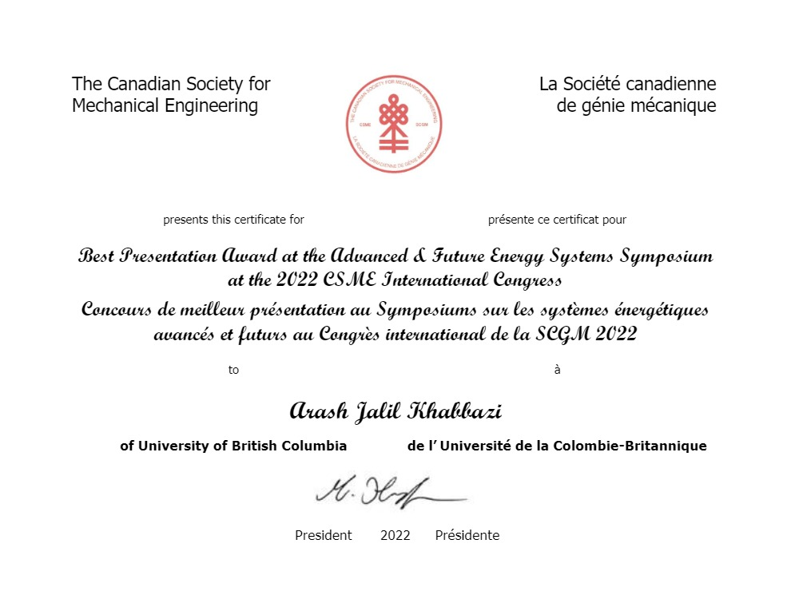

Green Hydrogen Supply to Urban Infrastructure and Buildings through Blending into the Existing Grid (June 2022, <a href="https://www.csme-scgm.ca/conferences" target="_blank" style="color:#0000FF; text-decoration:none;">CSME</a> 2022, University of Alberta, Edmonton, Canada), <a href="https://era.library.ualberta.ca/items/f608e27a-3211-49ab-867b-c399a35c6476" target="_blank" style="color:#0000FF; text-decoration:none;">Link</a>.

- Best Presentation of the symposium.

